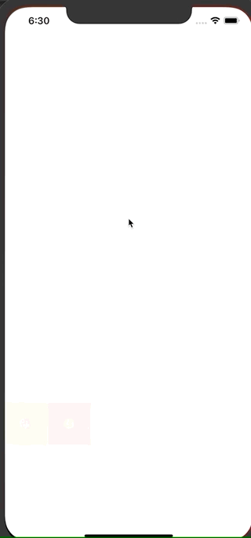

# 演示

# 如何生成LYGraffiti.xcframework

1. cd /LYGraffitiDemo/LYGraffiti
2. xcodebuild archive -scheme LYGraffiti -destination="generic/platform=iOS" -archivePath "./build/ios.xcarchive" -sdk iphoneos SKIP_INSTALL=NO BUILD_LIBRARIES_FOR_DISTRIBUTION=YES
3. xcodebuild archive ONLY_ACTIVE_ARCH=NO -scheme LYGraffiti -destination="generic/platform=iOS Simulator" -archivePath "./build/ios_sim.xcarchive" -sdk iphonesimulator SKIP_INSTALL=NO BUILD_LIBRARIES_FOR_DISTRIBUTION=YES
4. xcodebuild -create-xcframework -framework "./build/ios.xcarchive/Products/Library/Frameworks/LYGraffiti.framework" -framework "./build/ios_sim.xcarchive/Products/Library/Frameworks/LYGraffiti.framework" -output "./build/LYGraffiti.xcframework"
5. 拖拽 /build/LYGraffiti.xcframework  到主项目中，确保 [Target] -> General -> Frameworks, Libraries, and Embedded Content 中包含LYGraffiti.xcframework并且修改Embed状态为Embed & Sign

